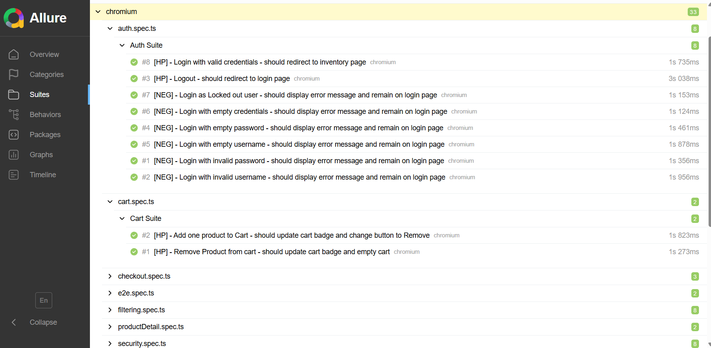

# SauceDemo Playwright Tests


Automated test suite for [SauceDemo](https://www.saucedemo.com) built with Playwright and TypeScript.

## 🛠️ Tech Stack

- [Playwright](https://playwright.dev/) – test automation framework
- [TypeScript](https://www.typescriptlang.org/) – typed JavaScript
- [Allure](https://allurereport.org/) – test reporting
- [GitHub Actions](https://github.com/features/actions) – CI/CD pipeline

## 📁 Project Structure

```
📁 tests/           – test suites
    auth.spec.ts        – authentication tests
    cart.spec.ts        – cart tests
    checkout.spec.ts    – checkout validation tests
    e2e.spec.ts         – end-to-end purchase flow
    filtering.spec.ts   – product filtering tests
    productDetail.spec.ts – product detail tests
    security.spec.ts    – security tests
    fixtures.ts         – shared test fixtures
📁 pages/           – Page Object Model
    LoginPage.ts
    InventoryPage.ts
    MenuPage.ts
    CartPage.ts
    CheckoutPage.ts
    CheckoutOverviewPage.ts
    CheckoutCompletePage.ts
    InventoryItemPage.ts
📁 helpers/
    credentials.ts      – test data (users, URLs, messages, products)
    sortUtils.ts        – helper functions
📄 playwright.config.ts – Playwright configuration
📄 tsconfig.json        – TypeScript configuration
📄 .env.example         – environment variables template
```

## ⚙️ Setup

### 1. Clone the repository

```bash
git clone https://github.com/veronikakurhajcova/saucedemoplaywrightts.git
cd saucedemoplaywrightts
```

### 2. Install dependencies

```bash
npm install
npx playwright install
```

### 3. Configure environment variables

```bash
cp .env.example .env
```

Fill in the values in `.env`:

```
BASE_URL=https://www.saucedemo.com
STANDARD_USERNAME=standard_user
LOCKED_USERNAME=locked_out_user
INVALID_USERNAME=invalid_username
PASSWORD=secret_sauce
INVALID_PASSWORD=invalid_password
```

##  Running Tests

```bash
# Run all tests
npm run test

# Run smoke tests only
npm run test:smoke

# Run regression tests only
npm run test:regression

# Run security tests only
npm run test:security

# Run E2E tests only
npm run test:e2e
```

##  Test Report

Generate and open Allure report:

```bash
npm run report
```



##  Test Tags

| Tag | Description |
|-----|-------------|
| `@smoke` | Critical tests – basic functionality |
| `@regression` | Full regression suite |
| `@security` | Security tests |
| `@e2e` | End-to-end tests |

##  Test Coverage

| Suite | Tests | Tags |
|-------|-------|------|
| Auth Suite | 8 | @smoke, @regression |
| Cart Suite | 2 | @smoke, @regression |
| Checkout Suite | 3 | @regression |
| E2E Suite | 1 | @smoke, @regression, @e2e |
| Filtering Suite | 4 | @regression |
| Product Detail Suite | 1 | @regression |
| Security Suite | 4 | @security, @regression |

##  Author

[Veronika Kurhajcová](https://github.com/veronikakurhajcova)
